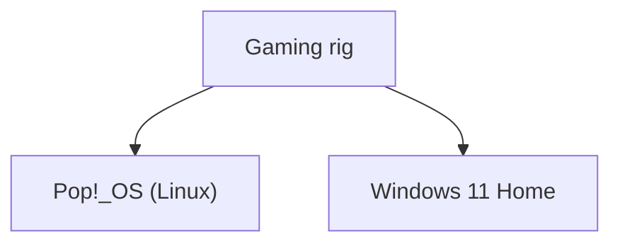
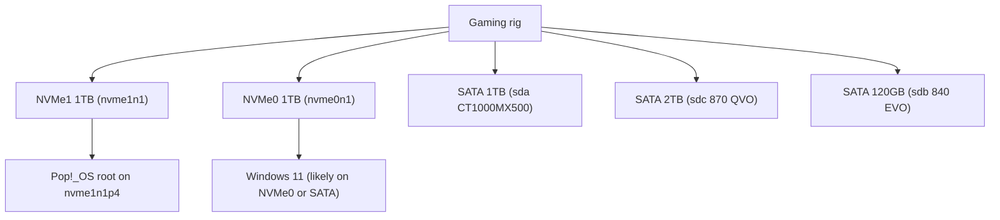

# Host: Gaming rig

**Role:** Desktop / gaming PC with dual boot **Pop!_OS** and **Windows 11 Home**.  
**Location:** LAN client (Wi-Fi `192.168.0.227`), used for gaming, desktop work, and occasional Docker use.

---

## 1. Hardware Summary

| Component | Details |
|----------|---------|
| CPU      | AMD Ryzen 7 5700X3D – 8 cores / 16 threads (`CPU(s): 16`) |
| RAM      | 32 GB (≈31 GiB) |
| GPU      | AMD Radeon RX 9070 XT (16 GB VRAM) |
| Motherboard | (Custom build – OEM fields not set) |
| Network  | Wi-Fi `wlp5s0` (`192.168.0.227/24`), wired NICs `enp6s0` & `enp42s0` currently unused |
| Virtual / misc | Docker bridge `docker0` at `172.17.0.1/16` |

### 1.1 Physical Storage (Windows view)

From Windows `Get-PhysicalDisk`:

| Drive (Windows name)        | Size      | Type |
|-----------------------------|-----------|------|
| CT1000MX500SSD1             | 1 TB      | SSD  |
| KINGSTON SA2000M81000G      | 1 TB      | SSD (NVMe) |
| Samsung SSD 870 QVO 2TB     | 2 TB      | SSD  |
| Samsung SSD 840 EVO 120GB   | 120 GB    | SSD  |
| KINGSTON SA2000M81000G      | 1 TB      | SSD (second NVMe) |

Total: **~5 TB** SSD storage across 5 drives.

### 1.2 Storage layout (Linux / Pop!_OS view)

From `lsblk -o NAME,SIZE,TYPE,MOUNTPOINT`:

```text
sda           931.5G disk  
└─sda1        931.5G part  

sdb           111.8G disk  
├─sdb1          128M part  
├─sdb2        110.7G part  
└─sdb3        867.5M part  

sdc             1.8T disk  
├─sdc1           16M part  
└─sdc2          1.8T part  

nvme0n1       931.5G disk  
├─nvme0n1p1      16M part  
└─nvme0n1p2   931.5G part  

nvme1n1       931.5G disk  
├─nvme1n1p1    1022M part  /boot/efi
├─nvme1n1p2       4G part  /recovery
├─nvme1n1p3       4G part  
│ └─cryptswap     4G crypt [SWAP]
├─nvme1n1p4   372.5G part  /
├─nvme1n1p5      16M part  
├─nvme1n1p6   549.2G part  
└─nvme1n1p7     738M part  
```

Approximate mapping / usage:

- **nvme1n1 (1 TB NVMe)**  
  - Contains **Pop!_OS**:  
    - `nvme1n1p1` – EFI system partition (`/boot/efi`)  
    - `nvme1n1p4` – root filesystem (`/`)  
    - `nvme1n1p3` → `cryptswap` – 4 GB encrypted swap  
- **nvme0n1 (1 TB NVMe)**  
  - Single large partition – **Windows 11 OS / games**.
- **sda (1 TB SATA)** – **Windows 11 games**.
- **sdb (120 GB SATA)** – 120 GB SSD, partitioned into ~128M + 110.7G + 867M (utility drive).
- **sdc (2 TB SATA)** – **Windows 11 games**.

---

## 2. Operating Systems (Dual Boot)

### 2.1 Pop!_OS (Linux)

From `lscpu`:

```text
Model name:  AMD Ryzen 7 5700X3D 8-Core Processor
CPU(s):      16
Socket(s):   1
NUMA node0:  0-15
```

From `free -h`:

```text
Mem:   31Gi total, ~3.7Gi used, ~23Gi free, ~25Gi available
Swap:  4.0Gi total, 0 used
```

- **Distro:** Pop!_OS (Ubuntu-based)
- **Kernel:** 6.12.10-76061203-generic
- **Root filesystem:** `nvme1n1p4` mounted at `/`
- **EFI partition:** `nvme1n1p1` mounted at `/boot/efi`
- **Swap:** encrypted `cryptswap` on `nvme1n1p3`

### 2.2 Windows 11


```text
OsName    : Microsoft Windows 11 Home
OsVersion : 10.0.26100
```

- **Edition:** Windows 11 Home  
- **Version:** 10.0.26100  

**Dual boot summary:**  
- **Pop!_OS** boots from NVMe (`nvme1n1`), using its own EFI entry.  
- **Windows 11** boots from another SSD, selected via firmware/boot menu or bootloader configuration.

---

## 3. GPU and Graphics

From Pop!_OS `lspci`:

```text
2d:00.0 VGA compatible controller: Advanced Micro Devices, Inc. [AMD/ATI] Navi 48 [RX 9070/9070 XT] (rev c0)
```

From Windows `Get-WmiObject win32_VideoController`:

```text
AMD Radeon RX 9070 XT
```

- **GPU:** AMD Radeon RX 9070 XT (Navi 48)  
- **Use cases:** gaming, VR/Virtual Desktop, hardware acceleration on Pop!_OS.


---

## 4. Network

From Pop!_OS `ip addr show`:

- **Wi-Fi interface:** `wlp5s0`
  - IPv4: `192.168.0.227/24` (dynamic)
  - Several IPv6 addresses
- **Wired NICs:**
  - `enp6s0` – currently `state DOWN`
  - `enp42s0` – currently `state DOWN`
- **Extra Wi-Fi adapter:** `wlx6245b4e7a4ef` – present, but `state DOWN`
- **Docker bridge:** `docker0`
  - IPv4: `172.17.0.1/16`

In homelab context, **Gaming rig** appears as:

> LAN client at `192.168.0.227` over Wi-Fi, with optional Docker networking via `docker0`.

---

## 5. Current Roles and Usage

- **Windows 11:**
  - Main usage: PC gaming, Game Pass / Steam / other launchers.
  - High-performance GPU: AMD RX 9070 XT.
- **Pop!_OS:**
  - Linux desktop and dev environment.
  - Can run containers via `docker0` (currently no specific services documented).
- **Future potential roles:**
  - Secondary compute node for CI / GPU workloads.
  - Local testing of Dockerized services (dev environment) separate from Proxmox stack.

---

## 6. Mermaid Diagrams

### 6.1 OS-level view of the Gaming rig



### 6.2 Storage & OS mapping (simplified)


