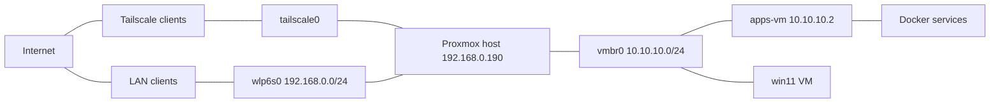

# Proxmox Homelab – Architecture & Inventory

## 1. Physical Host: `proxmox`

- **Role:** Main hypervisor / router for `10.10.10.0/24`
- **OS:** Proxmox VE (on NVMe)
- **CPU:** AMD Ryzen 5 3600 – 6 cores / 12 threads
- **RAM:** 32 GB
- **Swap:** 7.5 GB
- **GPU:** PCIe GPU passed through to `win11` VM
- **LAN NIC:** `wlp6s0` (LAN `192.168.0.0/24`)
- **VM bridge:** `vmbr0` (internal `10.10.10.0/24`)

### Storage

| Device  | Size    | Type / Role                  | Notes                                        |
|---------|---------|------------------------------|----------------------------------------------|
| nvme0n1 | 953.9GB | NVMe – Proxmox root disk     | p1 `/boot/efi`, p2 swap, p3 `/`             |
| sda     | 223.6GB | SATA SSD                     | General VM/host storage                      |
| nvme1n1 | 1.8TB   | NVMe                         | Extra data/VMs                               |
| sdb     | 10.9TB  | HDD (Seagate 12 TB)          | ZFS pool `tank`                              |

---

## 2. Virtual Machines

| VMID | Name     | Status  | vCPU | RAM (GB) | Ballooning | Disks                      | Notes                         |
|------|----------|---------|------|----------|------------|----------------------------|-------------------------------|
| 100  | win11    | stopped | 6    | 16       | disabled   | 50G qcow2 + 240G raw SSD   | GPU passthrough, hugepages    |
| 101  | apps-vm  | running | 4    | 16       | none       | 164G qcow2                 | virtiofs `appdata`, `media`   |

### apps-vm (VMID 101)

- **Role:** Docker host for media, infra, dashboards, DNS, etc.
- **IP:** `10.10.10.2` on `vmbr0`
- **CPU:** 4 vCPU (`x86-64-v2-AES`)
- **RAM:** 16 GB
- **Disk:** 164 GB qcow2
- **Shares:** `virtiofs0: appdata`, `virtiofs1: media`
- **Agent:** enabled
- **On-boot:** yes

### win11 (VMID 100)

- **Role:** Gaming / desktop VM
- **CPU:** `host,hidden=1`, 6 vCPU
- **RAM:** 16 GB, ballooning off
- **NUMA:** on
- **Hugepages:** 1 GB pages
- **GPU:** multiple PCIe devices passed through
- **Disks:** 50 GB qcow2 + 240 GB physical SSD
- **Boot:** UEFI + TPM 2.0

---

## 3. Docker Services on `apps-vm`

| Name                | Ports (host → container)           | Role                           |
|---------------------|------------------------------------|--------------------------------|
| qbittorrent         | 8080→8080, 6881→6881 TCP/UDP      | Torrent client                 |
| sonarr              | 8989→8989                         | TV automation                  |
| radarr              | 7878→7878                         | Movie automation               |
| prowlarr            | 9696→9696                         | Indexer manager                |
| sabnzbd             | 8090→8080                         | Usenet client                  |
| jellyfin            | 8096→8096                         | Media server                   |
| bazarr              | 6767→6767                         | Subtitles                      |
| scriberr            | 5080→8080                         | Transcription UI               |
| mealie              | 9925→9000                         | Recipe manager                 |
| foundry             | 30000→30000                       | VTT (TTRPG)                    |
| caddy               | 80→80, 443→443, 2019              | Reverse proxy / TLS            |
| nextcloud-web       | 8082→80                           | Nextcloud frontend             |
| nextcloud-app       | 9000 internal                     | Nextcloud PHP-FPM              |
| nextcloud-db        | 5432 internal                     | PostgreSQL DB                  |
| nextcloud-redis     | 6379 internal                     | Cache                          |
| grafana             | 3000→3000                         | Metrics dashboard              |
| prometheus          | 9090→9090                         | Metrics collector              |
| json-exporter       | 7979→7979                         | JSON exporter                  |
| node-exporter       | host metrics                      | Node metrics                   |
| pihole              | 53 TCP/UDP, 8088→80, 443, 67,123  | DNS + adblock                  |
| unbound             | 5335→53 TCP/UDP                   | Recursive DNS resolver         |
| dashy               | 7777→80                           | Start page / dashboard         |
| openspeedtest       | 9000→3000, 9001→3001              | Speed test                     |

---

## 4. Network & NAT

- **LAN:** `192.168.0.0/24` on `wlp6s0`
- **Internal:** `10.10.10.0/24` on `vmbr0` (`apps-vm` = `10.10.10.2`)
- **Routing:** `10.10.10.0/24` is NAT’d out via `wlp6s0`
- **DNS:** LAN → Proxmox:53 → Pi-hole (`10.10.10.2:53`) → Unbound

### Port Forwards (DNAT → 10.10.10.2)

| Host Port | Service      |
|----------:|-------------|
| 80 / 443  | Caddy / HTTP(S) entry |
| 8080      | qBittorrent |
| 8989      | Sonarr      |
| 7878      | Radarr      |
| 9696      | Prowlarr    |
| 8096      | Jellyfin    |
| 9090      | Prometheus  |
| 3000      | Grafana     |
| 9898      | HomeWizard P1 |
| 5080      | Scriberr    |
| 30000     | Foundry VTT |
| 9925      | Mealie      |
| 445       | SMB share   |
| 2222      | SSH → apps-vm |
| 6767      | Bazarr      |
| 8090      | SABnzbd     |
| 7777      | Dashy       |
| 9000/9001 | OpenSpeedTest |
| 8088      | Pi-hole UI  |

---

## 5. Mermaid Diagrams

```mermaid
graph TB
    AppsVM["apps-vm 10.10.10.2"]

    Caddy["Caddy reverse proxy"]
    Pihole["Pi-hole"]
    Unbound["Unbound"]
    Prom["Prometheus"]
    Grafana["Grafana"]
    Dashy["Dashy"]
    OpenST["OpenSpeedTest"]

    Jellyfin["Jellyfin"]
    Sonarr["Sonarr"]
    Radarr["Radarr"]
    Prowlarr["Prowlarr"]
    Qbit["qBittorrent"]
    SAB["SABnzbd"]
    Bazarr["Bazarr"]

    Mealie["Mealie"]
    Foundry["Foundry VTT"]
    Scriberr["Scriberr"]

    NCWeb["Nextcloud web nginx"]
    NCApp["Nextcloud app php fpm"]
    NCDB["Nextcloud db postgres"]
    NCRedis["Nextcloud redis"]

    NodeExp["node-exporter"]
    JSONExp["json-exporter"]

    AppsVM --> Caddy
    AppsVM --> Pihole
    AppsVM --> Unbound
    AppsVM --> Prom
    AppsVM --> Grafana
    AppsVM --> Dashy
    AppsVM --> OpenST
    AppsVM --> NCWeb
    AppsVM --> NCApp
    AppsVM --> NCDB
    AppsVM --> NCRedis

    Caddy --> Jellyfin
    Caddy --> Sonarr
    Caddy --> Radarr
    Caddy --> Prowlarr
    Caddy --> Qbit
    Caddy --> SAB
    Caddy --> Bazarr
    Caddy --> Mealie
    Caddy --> Foundry
    Caddy --> Scriberr
    Caddy --> NCWeb
    Caddy --> Dashy
    Caddy --> OpenST

    Pihole --> Unbound

    Prom --> NodeExp
    Prom --> JSONExp
    Grafana --> Prom
```

